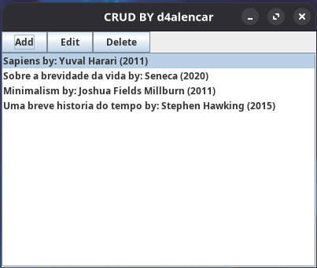

# Usage
First of all make sure [Java 21](https://www.oracle.com/br/java/technologies/downloads/), [Maven](https://github.com/apache/maven), [Docker](https://github.com/docker/compose) is installed on your computer.

`clone` the repository and change to its directory, then the postgreSQL container up 
```bash
#clone the repo
git clone github.com/d4alencar/crud_desktop

#change to its directory
cd crud_desktop

#initialize container
docker compose up -d
```

```
mvn clean
mvn compile exec:java
```


### next steps
- [ ] treat SQL Injections
- [x] add search tool
- [x] handle unexpected behaviour
- [ ] improve GUI

### tech stack

| Layer | Technology |
|-------|-------------|
| Language | Java (JDK 21) |
| GUI | Swing |
| Database | PostgreSQL |
| IDE | LunarVim |
| Build Tool | Maven |
